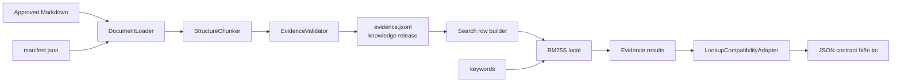

# 02 — Hướng A: Document BM25 tối giản

## 1. Mục tiêu

Thay nguồn tri thức từ các entity/fact trong ontology sang các đoạn bằng chứng lấy từ
tài liệu đã duyệt, nhưng giữ nguyên tối đa runtime và test contract hiện tại.

Đây là hướng phải làm trước vì:

- chạy local bằng CPU, không cần model local và không cần API embedding;
- dùng lại `bm25s`, analyzer và cách cộng điểm theo từng từ khóa;
- test được hoàn toàn offline;
- dễ chạy song song với ontology;
- việc cập nhật chuyển thành sửa tài liệu/metadata thay vì viết triples.

Hướng này **không** có nghĩa “ném PDF vào vector search”. Đầu vào giai đoạn đầu là
Markdown/HTML/TXT đã được duyệt; raw PDF chỉ là nguồn đối chiếu.

## 2. Kiến trúc



## 3. Thành phần và trách nhiệm

### 3.1 `DocumentLoader`

Đọc manifest và nội dung UTF-8, kiểm:

- file tồn tại;
- hash khớp bản được duyệt;
- `document_version_id` không trùng; nhiều version được phép dùng chung `document_id`;
- status là `published` mới được đưa vào release;
- `source_reference` và thông tin dựng citation không rỗng; URL công khai là tùy chọn
  vì tài liệu nội bộ vẫn có thể là nguồn hợp lệ.

Không gọi LLM. Không OCR. Không sửa nội dung ngầm.

### 3.2 `StructureChunker`

Chia theo cấu trúc, không cắt đều một số token cố định:

1. ưu tiên ranh giới `Điều`, `Khoản`, heading Markdown;
2. giữ heading cha trong `section_path`;
3. đoạn quá dài mới chia tiếp theo paragraph/list;
4. đoạn quá ngắn được ghép với đoạn cùng section;
5. bảng nhỏ giữ nguyên; bảng dài tách theo hàng nhưng lặp lại header;
6. link, số quyết định, ngày, đơn vị và số tiền không bị normalize khỏi bản gốc;
7. overlap chỉ dùng khi một câu/định nghĩa thực sự đi qua ranh giới, không lặp mù.

Ngưỡng kích thước là cấu hình và phải được chọn bằng benchmark, không ghi cứng như một
“best practice” chung cho mọi tài liệu.

### 3.3 `EvidenceValidator`

Chặn publish nếu:

- ID không ổn định hoặc trùng;
- evidence không trỏ về document;
- locator được khai báo nhưng không hợp lệ;
- source revision/locator thiếu; URL công khai có thể rỗng cho tài liệu nội bộ;
- `content` rỗng;
- hai evidence cùng ID nhưng khác hash;
- metadata ngày tháng/phạm vi sai kiểu.

Đây là phần kế thừa tinh thần SHACL: dữ liệu phải qua schema trước khi dùng, nhưng không
cần RDF.

### 3.4 `DocumentSearchEngine`

Interface đề xuất:

```python
class KnowledgeRetriever(Protocol):
    def search(self, keywords: Sequence[str]) -> EvidenceSearchResponse: ...
```

Implementation đầu tiên dùng thuật toán gần engine hiện tại nhất:

1. tạo nhiều search row cho mỗi evidence;
2. analyzer biến mỗi row và keyword thành các tiếng/từ đã chuẩn hóa;
3. BM25 lấy các row tốt nhất;
4. với từng keyword, một evidence chỉ nhận điểm của row tốt nhất;
5. điểm evidence là tổng điểm tốt nhất theo từng keyword;
6. trả top `k` evidence và danh sách keyword không khớp.

Các row đề xuất:

| Loại row | Nội dung |
|---|---|
| `title` | tên tài liệu + tiêu đề section |
| `heading` | toàn bộ `section_path` |
| `content` | nội dung evidence |
| `alias` | viết tắt/tên thường gọi đã duyệt |
| `metadata` | tên biểu mẫu, phòng ban, loại thủ tục có giá trị tìm kiếm |

Không index URL, hash, parser log hoặc metadata kỹ thuật.

### 3.5 `LookupCompatibilityAdapter`

Adapter nhận `EvidenceSearchResponse`, dựng JSON `found/not_found`, `matched`, `sources`
và `facts` như runtime hiện tại. Agent và UI không biết backend bên dưới đã đổi.

Trong mốc parity, giữ:

- giới hạn 20 keyword;
- mỗi keyword tối đa 120 ký tự;
- trim, loại rỗng, deduplicate;
- chạy search ở thread executor, không chặn event loop;
- `top_k=3` mặc định;
- `unmatched` và `truncation` như hiện tại.

Sau khi parity đạt mới xem xét response mới giàu `evidence_id`, locator và claim-level
citation hơn.

Golden payload V1 cho một evidence document:

```json
{
  "status": "found",
  "guidance": "Đọc evidence theo nguồn; không suy diễn ngoài nội dung.",
  "results": [
    {
      "label": "Nghỉ học tạm thời — Khoản 3 Điều 24",
      "classes": ["quy_che", "thu_tuc_hoc_vu"],
      "matched": ["Điều 24 · nghỉ học tạm thời"],
      "sources": [
        {
          "citation": "Khoản 3 Điều 24 Quy chế đào tạo ...",
          "url": "https://example.edu/qd-1052.pdf",
          "facts": [
            {
              "subject": "Nghỉ học tạm thời — Khoản 3 Điều 24",
              "property": "nội dung trích dẫn",
              "value": "Nguyên văn evidence đã được duyệt ..."
            }
          ]
        }
      ]
    }
  ]
}
```

Một fact V1 tương ứng một evidence nguyên khối hoặc một field/table row có nhãn rõ.
Không gộp nhiều chunk không liên quan thành một fact `nội dung`, vì sẽ làm prompt khó
phân biệt nguồn và có thể thay đổi hành vi refusal/citation. Golden payload này phải là
contract fixture cho cả adapter lẫn AgentLoop.

## 4. Dữ liệu và artifact đề xuất

Đây là layout dự kiến, chưa phải file đã được tạo trong phiên này:

```text
resources/
  documents/
    manifest.json             # khai báo tài liệu đã duyệt
    evidence.jsonl            # artifact sinh deterministic
    release.json              # version, hash, tool version, timestamp
  document-index/
    ...                       # BM25 artifact sinh lại được
references/
  *.md                        # bản nội dung được review
  *.pdf                       # bản gốc đối chiếu
```

`evidence.jsonl` và index là generated artifacts. Quyết định có commit chúng hay build
trong CI được đưa ra sau khi đo kích thước/thời gian. `manifest.json` và nội dung đã
review phải được version control.

## 5. Luồng cập nhật tri thức

```text
thêm/sửa tài liệu
→ cập nhật manifest
→ build evidence deterministic
→ xem diff evidence
→ validate
→ chạy targeted tests + full regression
→ tạo knowledge release
→ đổi backend/release bằng config
```

Một thay đổi chỉ build lại document có hash đổi. Ở corpus hiện tại có thể build toàn bộ
nếu đơn giản hơn; incremental build chỉ làm khi số đo cho thấy cần.

Không dùng LLM để tự tóm tắt thành canonical evidence trong bước đầu. Nội dung truy xuất
là nguyên văn hoặc phép ghép deterministic với heading/header bảng.

## 6. Cấu hình dự kiến

```text
ONTCHATBOT_KNOWLEDGE_BACKEND=ontology|document
ONTCHATBOT_DOCUMENT_MANIFEST=...
ONTCHATBOT_DOCUMENT_RELEASE=...
ONTCHATBOT_SEARCH_TOP_K=3
```

Default vẫn là `ontology` cho đến khi đạt mọi gate. Việc chuyển default là một commit
riêng và có rollback bằng một biến môi trường.

### 6.1 Chế độ suy giảm

```text
FULL          local/hybrid retrieval + generated answer
LEXICAL_ONLY embedding lỗi hoặc circuit mở → BM25 + generated answer
EVIDENCE_ONLY generation lỗi → render evidence + citation deterministic
UNAVAILABLE  local release/index cũng không dùng được
```

V1 `EVIDENCE_ONLY` dùng renderer backend phát `text_delta` và `completed` hiện có, nên
không cần thay UI/SSE protocol. Nội dung phải ghi rõ đây là bằng chứng tìm được, chưa
phải câu trả lời đã được model tổng hợp. Mỗi mode có metric riêng; đây là reliability
budget của prototype, không phải production SLA.

## 7. Kế hoạch test riêng cho hướng A

### Unit tests

- parser heading/Điều/khoản sinh ID ổn định;
- bảng tách hàng vẫn lặp header;
- hash/manifest/status/locator được validate;
- analyzer và ranking deterministic;
- blank/unmatched/top-k giống contract cũ;
- citation được dựng từ đúng document và locator;
- adapter xuất đúng JSON shape;
- golden payload được AgentLoop đọc đúng và không trộn nguồn;
- search không chạy trên event-loop thread.

### Contract tests

Chạy cùng một bộ test lookup với hai fixture:

```text
contract suite
├─ OntologyLookup
└─ DocumentLookup
```

Test không so chuỗi prose hoàn toàn giống nhau; nó so invariant:

- trạng thái found/not_found;
- evidence đúng;
- source/citation đúng;
- input bounds;
- không lộ dữ liệu kỹ thuật;
- đóng resource đúng.

### Regression tests

- chạy đủ 57 scenarios: map 49 `node_dung` sang gold evidence và định nghĩa outcome
  mới cho 8 formerly-excluded cases;
- không được có unreviewed loss trong 48 legacy successes; thay đổi gold chỉ hợp lệ khi
  evidence mới vẫn trả lời đúng câu hỏi và có `change_reason` được review;
- 85 câu vẫn chạy qua cùng AgentLoop;
- replay mode dùng scripted LLM để test offline;
- live Gemini run là phép đánh giá riêng, không là điều kiện để chạy test local.

## 8. Tiêu chí nghiệm thu

Hướng A chỉ được xem là hoàn thành khi:

- toàn bộ test cũ vẫn xanh trong nhánh migration;
- toàn bộ contract test mới xanh cho cả hai backend;
- mọi 57 retrieval scenarios đều chạy; chất lượng không kém baseline và không có
  unreviewed loss trong 48 legacy successes sau gold mapping;
- 85 tình huống vẫn chạy được, không mất nhóm refusal;
- mọi evidence trả ra truy được về file và locator;
- build/test không dùng mạng, API key, GPU hoặc local LLM;
- build time, peak RAM, artifact size và warm-query p95 đạt budget được chốt từ phép đo
  G0 trên chính laptop phát triển; không bịa threshold trước khi có baseline;
- có config rollback về ontology mà không đổi UI/API.
- fault test chứng minh `EVIDENCE_ONLY` dùng SSE hiện tại khi generation API lỗi.

## 9. Ưu điểm, giới hạn và cách xử lý

| Nội dung | Đánh giá |
|---|---|
| Chi phí máy dev | Rất thấp |
| Chi phí API retrieval | 0 |
| Độ dễ test | Cao |
| Cập nhật tài liệu | Dễ hơn ontology |
| Đồng nghĩa/paraphrase | Có thể yếu |
| Hiệu lực/xung đột | Chưa đủ nếu đứng một mình |
| Khác biệt so với chat PDF | Thấp nếu dừng tại đây |

Vì vậy A là nền chuyển đổi, không phải điểm kết thúc của đề tài. Điểm khác biệt được
bổ sung ở hướng D; điểm yếu semantic chỉ được bổ sung bằng B nếu số đo yêu cầu.

## 10. Những việc không làm trong hướng A

- Không cài vector database.
- Không parse lại toàn bộ PDF.
- Không gọi LLM lúc ingestion.
- Không tối ưu agent từ hai lượt gọi model xuống một lượt cùng lúc refactor backend.
- Không xóa ontology/admin/SHACL.
- Không tự suy ra effective date hoặc scope từ câu chữ chưa được reviewer xác nhận.
