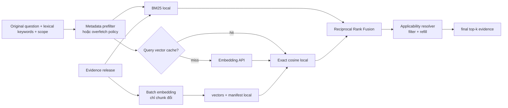

# 03 — Hướng B: Hybrid BM25 + embedding API

## 1. Khi nào hướng này hợp lý?

Chỉ triển khai sau khi Document BM25 đã đạt parity và benchmark mở rộng chỉ ra các lỗi
thực sự do lexical retrieval, ví dụ:

- cách nói đời thường không chung từ với văn bản;
- đồng nghĩa/viết tắt chưa có alias;
- câu hỏi mô tả tình huống thay vì gọi đúng tên thủ tục;
- một ý nằm ở nhiều cách diễn đạt.

Không thêm dense retrieval chỉ vì đây là kiến trúc phổ biến. Với corpus nhỏ, BM25 có
thể đã đủ và API chỉ làm tăng latency, chi phí và failure modes.

## 2. Kiến trúc



Generation API và embedding API là hai interface riêng. Có thể cùng provider, nhưng
không được ghép chúng thành một client khó thay thế.

Hybrid V2 cần query contract giàu hơn JSON tool hiện tại:

```python
@dataclass(frozen=True)
class RetrievalQuery:
    original_text: str
    lexical_queries: tuple[str, ...]
    context: ApplicabilityContext
```

- BM25 dùng `lexical_queries` để giữ lợi thế của từ khóa đã chuẩn hóa.
- Dense channel embed `original_text`, không embed một danh sách từ khóa do LLM rút
  gọn vì sẽ làm mất ngữ nghĩa tình huống.
- `context` dùng cho prefilter thời gian/phạm vi.

Lookup V1 hiện chỉ nhận `keywords[]`; vì vậy chưa đủ cho dense experiment đúng nghĩa.
Chỉ mở rộng orchestrator/port sang `RetrievalQuery` sau Document BM25 parity, trong một
task riêng và vẫn giữ adapter V1. Việc mở rộng này không cần thêm lượt LLM.

## 3. Thiết kế tối thiểu

### 3.1 `EmbeddingProvider`

```python
class EmbeddingProvider(Protocol):
    async def embed_query(self, text: str) -> list[float]: ...
    async def embed_documents(self, texts: Sequence[str]) -> list[list[float]]: ...
```

Implementation thật gọi API. Test dùng fake deterministic; không đọc secret và không
gọi Internet.

Với Gemini Embeddings 2, nhiều input truyền trực tiếp có thể được aggregate thành một
embedding. `embed_documents` phải gửi từng document dưới dạng `Content` riêng hoặc dùng
Batch API, rồi kiểm số vector trả về đúng số evidence; xem
[Gemini Embeddings](https://ai.google.dev/gemini-api/docs/embeddings).

### 3.2 Vòng đời vector

Mỗi vector phải gắn với:

```json
{
  "evidence_id": "...",
  "content_hash": "sha256:...",
  "provider": "google",
  "model": "...",
  "dimensions": 768,
  "instruction_version": "retrieval-v1",
  "normalized": true
}
```

Provider adapter cũng phải version hóa format đầu vào. Ví dụ document gồm title,
section path và text; query gồm task instruction và câu hỏi gốc. Không ghép tùy tiện
list keyword/document thành một string mà không tăng `instruction_version`.

Query cache key tối thiểu:

```text
provider + model + dimensions + instruction_version + normalized_query_hash
```

Chỉ tái embed evidence có `content_hash` đổi. Khi đổi model, dimension hoặc instruction,
tạo index version mới; không trộn vector của hai không gian. Tài liệu Gemini hiện cũng
nêu rõ các thế hệ embedding có thể không tương thích và việc migration có thể cần
re-embed toàn bộ corpus: [Gemini Embeddings](https://ai.google.dev/gemini-api/docs/embeddings).

### 3.3 Lưu và search vector

Với corpus hiện tại, lưu ma trận NumPy và exact cosine scan là đủ:

- không cần service riêng;
- không cần HNSW;
- deterministic và dễ test;
- `numpy` đã là dependency của dự án.

Chỉ chuyển sang pgvector/vector database khi số evidence và phép đo latency chứng minh
exact scan không còn đạt budget. pgvector hỗ trợ full-text + vector và RRF, nhưng đó là
đường scale sau này, không phải yêu cầu của prototype:
[pgvector Hybrid Search](https://github.com/pgvector/pgvector/blob/master/README.md#hybrid-search).

### 3.4 Fusion

Dùng Reciprocal Rank Fusion (RRF), không cộng trực tiếp BM25 score với cosine score:

```text
RRF(e) = Σ 1 / (k + rank_channel(e))
```

Lý do: hai score khác thang đo. `k` và số candidate là config, được khóa bằng benchmark.
Nếu một channel không có evidence, channel còn lại vẫn trả kết quả.

Không dùng LLM reranker trong bước đầu vì sẽ thêm một lượt generative/API cho mỗi câu,
khó test và không cần thiết ở corpus nhỏ.

Metadata filter phải chạy trước candidate search khi backend hỗ trợ. Nếu index local
chưa filter được, mỗi channel lấy dư candidate, resolver loại sai version/scope rồi
refill đến `top_k`. Không lấy đúng ba kết quả trước rồi mới lọc, vì có thể làm rỗng kết
quả dù evidence đúng đang ở hạng sau.

## 4. Chi phí và độ tin cậy

### Ingestion

- embed theo batch, chỉ với evidence mới/đổi;
- cache bằng content hash;
- có thể chạy thủ công, không nằm trên chat runtime;
- lưu số input, số vector, model, thời gian, lỗi và ước tính chi phí trong release log.

### Mỗi câu hỏi

- 0 logical embedding operation nếu query cache hit;
- tối đa 1 logical embedding operation nếu cache miss;
- vẫn chỉ dùng lượt generative giống mốc tương thích;
- timeout embedding ngắn hơn tổng timeout của lượt chat.

Một logical operation có thể tạo nhiều HTTP attempts do retry; hai số này phải được
đếm riêng. Budget mục tiêu:

| Chế độ | Logical model/API budget mỗi câu |
|---|---|
| A/D parity, không lookup | 1 generation operation |
| A/D parity, có lookup | thường 2 generation operations; hard cap loop hiện tại là 4 |
| B parity | như A/D + 0/1 query embedding operation |
| B ingestion | batch offline, chỉ evidence mới/đổi |
| Post-parity direct retrieval | 1 generation + 0/1 query embedding operation |
| C1 File Search | 1 managed-answer operation; retrieval bên trong không quan sát được |

### Khi provider lỗi

```text
timeout / transient rate_limit / 503
→ retry hữu hạn trong tổng deadline
→ circuit breaker nếu lỗi lặp lại
→ ghi fallback_reason
→ dùng BM25

quota_exceeded / auth / malformed request
→ không retry ngắn hạn
→ mở fallback ngay
```

Không phân loại chỉ bằng HTTP 429: `rate_limit_exceeded`/`too_many_requests` có thể
retry với backoff, còn `quota_exceeded` cần chờ quota reset hoặc thay quota. Xem
[Gemini API errors](https://ai.google.dev/gemini-api/docs/api-errors) và
[troubleshooting](https://ai.google.dev/gemini-api/docs/troubleshooting).

Chỉ một tầng sở hữu retry — SDK hoặc application — để tránh retry chồng. Config phải
khóa tổng deadline và physical attempts. Circuit mở sau ngưỡng lỗi, có cooldown và một
half-open probe; khi mở thì đi BM25 ngay. Với streaming generation, không tự retry cùng
stream sau khi đã phát token cho người dùng.

Metrics tối thiểu: `logical_operations`, `http_attempts`, `fallback_reason`, trạng thái
circuit và thời gian từng channel.

Không hard-code giá vào code hay đặc tả. Giá/quota thay đổi; pipeline phải ghi usage và
đọc budget từ config. Trước mỗi lần chọn model, kiểm lại trang pricing/rate-limit chính thức.

## 5. Feature flags

```text
ONTCHATBOT_RETRIEVAL_MODE=lexical|hybrid|shadow
ONTCHATBOT_EMBEDDING_PROVIDER=google
ONTCHATBOT_EMBEDDING_MODEL=...
ONTCHATBOT_EMBEDDING_TIMEOUT_SECONDS=...
ONTCHATBOT_RRF_K=...
```

- `lexical`: chỉ BM25, luôn khả dụng.
- `shadow`: chạy hybrid và log thứ hạng nhưng câu trả lời vẫn dùng BM25.
- `hybrid`: phục vụ kết quả fusion; tự fallback BM25.

Không bật `hybrid` làm default ngay khi code vừa hoàn thành.

## 6. Test plan

### Offline unit/contract

- fake provider trả vector cố định;
- cache hit không gọi provider;
- cache namespace đổi theo provider/model/dimension/instruction;
- changed hash chỉ re-embed chunk đổi;
- model/dimension/instruction khác làm index bị từ chối;
- exact cosine xếp đúng fixture;
- RRF deterministic khi đồng hạng hoặc thiếu một channel;
- timeout/transient 429/503 chuyển sang BM25 sau bounded retry;
- quota/auth/bad-request không retry; circuit-open bỏ qua API;
- không có retry chồng giữa SDK và application;
- không log API key hay raw authorization header;
- hybrid giữ nguyên lookup JSON contract.

### Evaluation

Ngoài 57 scenarios hiện có (49 legacy-scored), tạo tập mới tập trung vào:

- paraphrase;
- đồng nghĩa;
- typo và không dấu;
- viết tắt;
- câu tình huống;
- negative/out-of-scope;
- hai đoạn gần nghĩa nhưng khác phạm vi.

Chạy ít nhất ba cấu hình trên cùng corpus/release/model sinh câu trả lời:

1. BM25 document;
2. dense-only;
3. hybrid RRF.

Đo retrieval Recall@k/nDCG, evidence-set recall, refusal, citation accuracy, p50/p95,
API calls/query và cost/1.000 query. Không dùng chỉ answer style để kết luận retrieval tốt.

## 7. Gate để bật hybrid

Hybrid chỉ được bật mặc định khi đồng thời:

- không có unreviewed loss trong 48 legacy successes; gold migration hợp lệ phải giữ
  câu trả lời đúng và có `change_reason` được review;
- citation precision/completeness không giảm;
- cải thiện rõ trên nhóm paraphrase/đồng nghĩa đã đóng băng, ví dụ khắc phục ít nhất
  một nửa lexical misses hoặc tăng Recall@5 ít nhất 5 điểm phần trăm;
- BM25 fallback vượt test fault injection;
- latency và chi phí nằm trong budget đã được người maintain chấp nhận;
- lợi ích lặp lại qua nhiều lần chạy, không chỉ một run LLM.

Nếu không đạt, giữ code ở `shadow` hoặc bỏ. BM25 không phải phương án “tạm kém” nếu số
đo cho thấy nó phù hợp hơn.

## 8. Ưu điểm và giới hạn

| Nội dung | Đánh giá |
|---|---|
| Trần recall semantic | Cao hơn BM25 |
| Tài nguyên local | Nhẹ; exact scan CPU |
| API dependency | Có, một call/query cache miss |
| Test offline | Có nếu interface/fake đúng |
| Complexity | Trung bình |
| Vendor lock-in | Giảm nhờ lưu manifest và provider interface, nhưng không bằng BM25 |
| Giải hiệu lực/xung đột | Không; phải dùng hướng D |

Dense retrieval chỉ giúp tìm đoạn gần nghĩa. Nó không biết một văn bản đã hết hiệu lực,
không biết đối tượng nào được áp dụng và không được phép tự phân xử xung đột.

## 9. Những việc không làm trong hướng B

- Không tải model embedding local nặng về máy dev.
- Không cài vector database trước khi exact scan thất bại budget.
- Không dùng embedding như dependency duy nhất.
- Không thay retrieval và generation bằng cùng một managed call.
- Không dùng cross-encoder/LLM reranker trước khi RRF được đo.
- Không gửi tài liệu nhạy cảm cho provider khi chưa có quyền và chính sách dữ liệu.
