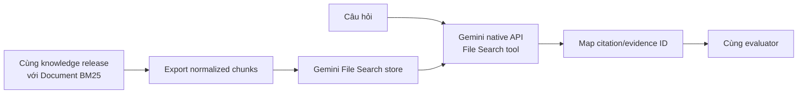

# 04 — Hướng C: Managed File Search

## 1. Mục đích của hướng này

Managed retrieval là một phương án hợp lý để làm baseline nhanh hoặc PoC, nhưng không
phù hợp làm lõi của prototype hiện tại. Nó chuyển việc chunk/embed/index/search sang
nhà cung cấp, giảm tải máy dev nhưng đổi lại bằng vendor dependency, ít khả năng kiểm
soát và khó giữ test parity.

Hai mức được xem xét:

- **C1 — Gemini File Search:** đơn giản, gắn trực tiếp với Gemini API.
- **C2 — Agent Search/managed search:** nhiều khả năng ingestion/search hơn, phù hợp
  hơn với hệ thống doanh nghiệp nhưng quá cỡ cho scope hiện tại.

## 2. C1 — Gemini File Search

Theo tài liệu chính thức, File Search import, chunk, index và retrieve dữ liệu rồi đưa
context vào Gemini. Dịch vụ có metadata filter, citation, giới hạn file/store và mô
hình chi phí hiện tại: tính embedding lúc index lần đầu, storage và query-time embedding
miễn phí, còn retrieved document tokens được tính như context/input tokens thông thường:
[Gemini File Search](https://ai.google.dev/gemini-api/docs/file-search).

### Sơ đồ PoC công bằng



Không nên so:

```text
raw PDF → managed parser/retrieval
```

với:

```text
approved Markdown → local BM25
```

vì khi đó parser, chunker, retriever và generator đều khác; kết quả không cho biết
thành phần nào tạo ra chênh lệch. PoC công bằng phải upload chính các normalized chunks
của cùng một knowledge release, giữ cùng corpus và bộ câu hỏi.

### Ưu điểm

- gần như không dùng CPU/RAM local cho indexing/search;
- thời gian có PoC ngắn;
- provider quản lý embeddings và store;
- tiện để biết một giải pháp managed đạt chất lượng nào trên cùng dữ liệu.

### Bất lợi trong dự án này

- client hiện dùng OpenAI-compatible chat/tool-call; File Search là built-in tool của
  Gemini native API, vì vậy không phải chỉ đổi `base_url`;
- retrieval và generation cùng failure domain;
- ranking/chunk internals khó kiểm soát và tái lập như BM25 local;
- test local không thể phụ thuộc store từ xa;
- đổi provider kéo theo đổi ingestion, index và runtime;
- 429/503/timeout có thể làm cả retrieval lẫn generation không khả dụng;
- dễ làm đóng góp của đồ án bị nhìn như “upload file rồi chat”.

File Search còn có giới hạn và bất tương thích giữa một số built-in grounding tools;
cần kiểm lại tài liệu tại thời điểm PoC thay vì mặc định mọi tool kết hợp được.

## 3. C2 — Agent Search/managed search

Nhóm dịch vụ managed search lớn hơn có thể cung cấp keyword + semantic search, metadata
filter, OCR/layout parser, connector và grounded answer. Google mô tả các khả năng đó
trong [Agent Search overview](https://docs.cloud.google.com/generative-ai-app-builder/docs/about-generic-search)
và [document parsing/chunking](https://docs.cloud.google.com/generative-ai-app-builder/docs/parse-chunk-documents).

Hướng này chỉ đáng cân nhắc khi bài toán đã đổi thành:

- nhiều nguồn dữ liệu phải đồng bộ liên tục;
- có ngân sách cloud và quản trị GCP;
- ưu tiên giảm công vận hành hơn quyền kiểm soát thuật toán;
- cần connector/OCR/layout managed;
- mục tiêu triển khai cấp trường quan trọng hơn khả năng tái lập đồ án trên laptop.

Đó chưa phải bối cảnh hiện tại.

## 4. Cách bọc managed backend nếu vẫn làm PoC

Gemini File Search hiện nên được xem là một **managed answer backend**, không phải một
`KnowledgeRetriever` thay thế tương đương BM25. API tích hợp retrieval vào lượt sinh và
trả answer/citation annotations, nhưng không cam kết expose raw ranked chunks/scores để
ta tính Recall@k giống local retriever. Vì vậy không được dựng giả một
`EvidenceSearchResponse` chi tiết hơn dữ liệu provider thật sự trả.

Không cho SDK/provider object đi thẳng vào AgentLoop. Tạo port riêng:

```python
class ManagedAnswerBackend(Protocol):
    async def answer(self, query: str, filters: dict) -> ManagedAnswer: ...
```

Adapter chỉ trả những gì quan sát được:

```json
{
  "answer": "...",
  "citations": [
    {
      "document_uri": null,
      "file_name": null,
      "source": null,
      "custom_metadata": {"local_chunk_id": "..."},
      "start_index": null,
      "end_index": null,
      "page_number": null
    }
  ],
  "provider_trace_id": "...",
  "raw_rank_available": false
}
```

Các field citation trên đều optional và adapter chỉ copy field API thật sự trả; không
tự điền giá trị suy đoán. `provider_trace_id` cũng optional theo response có thể quan sát.
Schema phải được đối chiếu lại với [Interactions API](https://ai.google.dev/api/interactions-api)
tại thời điểm PoC vì field/khả năng có thể thay đổi.

Mọi document/chunk upload cần mang stable local ID trong metadata. Không dùng filename
do provider sinh làm ID nghiệp vụ. Lưu mapping release → store/document IDs để xóa,
rebuild và audit được. Citation annotation chỉ được map về local ID khi provider trả đủ
metadata; không suy đoán mapping từ câu chữ.

`local_chunk_id` chỉ map chắc chắn nếu mỗi `EvidenceUnit` được upload thành một provider
document/file riêng và stable ID nằm trong custom metadata. Nếu nhiều evidence bị gộp
vào một file, metadata file-level không đủ xác định internal chunk; PoC phải báo tỷ lệ
citation chỉ map được tới file thay vì giả vờ có chunk-level provenance.

Agent Search có search/retrieval API riêng nên có thể là `ManagedRetriever`; không được
đánh đồng contract đó với Gemini File Search.

## 5. Đồng bộ dữ liệu

Quy trình PoC:

1. tạo knowledge release local đã validate;
2. export normalized chunks;
3. tạo store dành riêng cho release;
4. upload idempotent theo hash;
5. chờ index hoàn tất;
6. chạy evaluation;
7. ghi provider/model/store config và timestamp;
8. xóa store thử nghiệm khi không còn dùng.

Không upload raw source chứa dữ liệu cá nhân hoặc tài liệu chưa được phép. API key chỉ
đọc từ environment/secret store, không ghi vào manifest, test fixture, log hoặc Git.

## 6. Test strategy

### Bắt buộc chạy offline

- fake managed client trả response đã ghi;
- adapter map đúng evidence/citation;
- timeout/transient rate-limit/503 có lỗi đọc được hoặc fallback local; quota/auth/bad
  request không retry ngắn hạn;
- không log secret;
- lookup/API/SSE contract vẫn giữ;
- local BM25 fallback chạy khi managed backend không khả dụng.

### Integration test tùy chọn

- yêu cầu biến môi trường rõ ràng;
- dùng store riêng và quota nhỏ;
- không chạy mặc định trong `pytest`/CI;
- cleanup idempotent;
- không dùng kết quả một lần làm merge gate deterministic.

### Benchmark

Gemini File Search được so end-to-end trên cùng release và gold set:

- answer correctness/completeness;
- citation support/completeness và tỷ lệ citation map được về local chunk;
- citation locator accuracy;
- refusal/false positive;
- latency p50/p95;
- cost indexing và cost/query;
- thời gian cập nhật một document;
- khả năng truy vết tại sao kết quả được chọn;
- tỷ lệ thành công khi fault injection/provider unavailable.

Không báo Recall@k/rank quality cho Gemini File Search nếu API không trả raw ranked
results. Với Agent Search retrieval API, có thể đo Recall@k riêng nếu response thực sự
expose kết quả và score/ordering.

## 7. Gate để chọn managed làm lõi

Chỉ xem xét lại quyết định “không dùng làm lõi” nếu PoC chứng minh đồng thời:

- chất lượng vượt rõ ràng A/B trên bộ test đã đóng băng;
- mapping citation đáp ứng yêu cầu audit;
- cost và quota được chấp nhận;
- có local/fallback mode cho các chức năng tối thiểu;
- provider outage không làm mất toàn bộ trải nghiệm;
- lợi ích vận hành đủ lớn để chấp nhận lock-in;
- kiến trúc vẫn thể hiện được đóng góp policy-aware của dự án.

Nếu không đạt, giữ managed backend như baseline nghiên cứu, không đưa vào runtime chính.

## 8. Kết luận cho scope hiện tại

| Phương án | Vai trò |
|---|---|
| Gemini File Search | PoC/managed baseline ngắn hạn |
| Agent Search | phương án tương lai nếu triển khai hệ sinh thái GCP cấp trường |
| Local Document BM25 | backend chính ở bước refactor đầu |

Managed File Search giải quyết nhiều việc kỹ thuật, nhưng đồng thời lấy đi quyền kiểm
soát và khả năng test mà mục tiêu hiện tại đặt cao nhất. Vì vậy nó là hướng hợp lý để
**đo**, không phải hướng tối ưu để **chọn ngay**.
