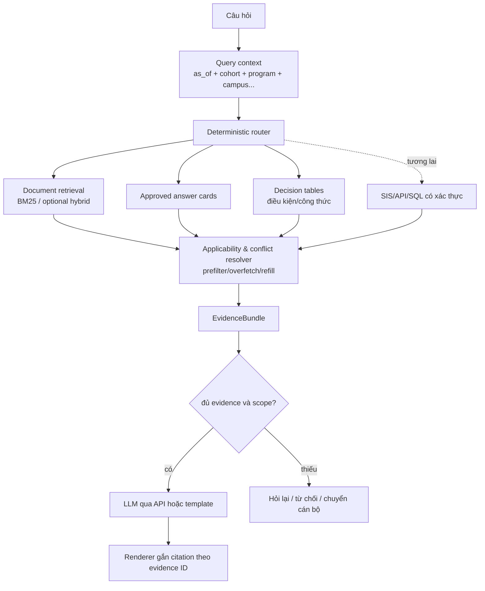

# 05 — Hướng D: Document QA có lớp policy-aware chọn lọc

## 1. Mục tiêu

Đây là kiến trúc đích phù hợp nhất cho chatbot học vụ:

> Tài liệu vẫn là nguồn sự thật, nhưng hệ thống biết văn bản nào có hiệu lực, áp dụng
> cho ai và quan hệ giữa các phiên bản; chỉ các quyết định quan trọng mới được cấu trúc
> thành metadata hoặc rule.

Nó khác full ontology ở chỗ không biến mọi câu thành triple. Nó cũng khác chat PDF ở
chỗ không chọn đoạn chỉ dựa trên độ gần nghĩa.

D không thay BM25/hybrid. Nó nằm trên retriever để quyết định evidence nào được phép
dùng. Triển khai đầu tiên là **D + Document BM25**; dense retrieval là tùy chọn sau đó.

## 2. Kiến trúc



Không có “agent cho FAQ”, “agent cho rule” hay “agent cho conflict”. Router, filter và
resolver là code xác định; LLM chỉ diễn đạt đầu ra đã được giới hạn.

Resolver là broker chung nhưng dùng check theo từng lane: document/card/rule qua
time/scope/lineage, còn API qua authorization, timestamp/freshness và source-system
identity. Không áp precedence văn bản một cách máy móc lên response từ SIS/API.

Router V1 không được giấu thêm một classifier LLM:

- ngày lấy từ trường `as_of` có cấu trúc hoặc regex cho ngày/năm rõ ràng;
- cohort/program lấy từ hồ sơ đã xác thực, lựa chọn UI hoặc slot người dùng xác nhận;
- FAQ dùng exact alias/approved phrase match;
- rule dùng danh sách intent khai báo trước cho vertical slice;
- không khớp lane đặc biệt thì về document retrieval;
- thiếu thuộc tính làm đổi đáp án thì hỏi lại, không suy đoán.

## 3. Mô hình dữ liệu chọn lọc

### 3.1 Thời gian

Phân biệt ít nhất:

- `issued_at`: ngày ban hành;
- `effective_from`: bắt đầu áp dụng;
- `effective_to`: hết áp dụng;
- `recorded_at`: hệ thống nhận biết phiên bản;
- `retired_at`: release ngừng phục vụ phiên bản.

Không dùng quy tắc “văn bản ban hành mới hơn luôn thắng”. Một văn bản mới có thể chưa
có hiệu lực hoặc chỉ áp dụng cho khóa khác.

### 3.2 Phạm vi

Metadata chỉ thêm khi có căn cứ và ảnh hưởng đáp án:

```yaml
scope:
  cohort: [65, 66]
  program: [chinh_quy]
  degree: [dai_hoc]
  campus: [nha_trang]
  faculty: []
  major: []
  audience: [sinh_vien]
```

Không dùng `null/[]` mơ hồ. Mỗi chiều scope có trạng thái rõ:

- `restricted` + danh sách giá trị: phạm vi đã biết;
- `universal`: reviewer xác nhận áp dụng chung;
- `unknown`: chưa xác minh, không được coi như `universal`.

### 3.3 Quan hệ phiên bản

Chỉ cần một graph mỏng, có thể lưu bằng JSON hoặc bảng quan hệ:

```text
document_version
  ├─ amends       → document_version
  ├─ supersedes   → document_version
  ├─ repeals      → document_version
  ├─ implements   → document_version
  └─ contains     → evidence_unit
```

Không cần graph database. Ở prototype, manifest JSON + validator là đủ; SQLite built-in
có thể dùng nếu truy vấn/constraint bắt đầu phức tạp. PostgreSQL range types là lựa
chọn scale sau này, không phải dependency hiện tại:
[PostgreSQL range types](https://www.postgresql.org/docs/current/rangetypes.html).

## 4. Resolver hiệu lực, phạm vi và xung đột

Thứ tự xử lý deterministic:

1. lấy `as_of_date`; nếu người dùng không nói thì dùng ngày hiện tại và hiển thị rõ;
2. lấy scope từ câu hỏi hoặc context đã xác nhận;
3. loại draft, revoked, chưa hiệu lực và hết hiệu lực;
4. loại evidence không khớp cohort/program/degree/campus/audience;
5. áp dụng quan hệ amend/supersede/repeal đã được reviewer duyệt;
6. áp dụng bảng precedence do nhà trường định nghĩa;
7. phân biệt ngoại lệ cụ thể với xung đột thật;
8. nếu scope còn thiếu và làm đổi đáp án, hỏi lại;
9. nếu xung đột chưa giải được, đưa cả hai nguồn và chuyển cán bộ, không để LLM chọn.

Applicability không được áp dụng ngây thơ sau khi retriever đã cắt top 3. Backend phải
prefilter theo metadata nếu có thể; nếu không thì overfetch, lọc và refill. `top_k` cuối
cùng chỉ được cắt sau resolver. Quan hệ `supersedes/amends/repeals` cũng phải mở rộng
tập candidate sang các version liên quan, kể cả khi chúng không nằm trong lexical top 3.

Output không chỉ là list chunk:

```json
{
  "status": "answerable",
  "as_of": "2026-10-01",
  "scope": {"program": "chinh_quy", "cohort": "66"},
  "evidence_ids": ["qd-1052/2025-07-17/dieu-24/khoan-3"],
  "excluded": [
    {"evidence_id": "...", "reason": "superseded"}
  ],
  "warnings": []
}
```

Decision trace này phải log được theo ID/lý do, không log dữ liệu cá nhân không cần thiết.

## 5. Các knowledge lane

### 5.1 Document evidence

Dùng cho quy định, thủ tục, biểu mẫu và giải thích. Đây là lane mặc định.

### 5.2 Approved answer card

Dùng cho FAQ ổn định/lưu lượng cao. Một card không phải câu trả lời rời nguồn; nó có:

- các cách hỏi tương đương;
- nội dung/template đã duyệt;
- `evidence_ids` phụ thuộc;
- effective period và scope;
- owner/reviewer/review deadline.

Khi evidence bị thay thế, card tự thành `stale` và không phục vụ cho đến khi duyệt lại.
FAQ card có thể trả lời không cần generative LLM.

### 5.3 Decision table/rule

Dùng cho điều kiện học bổng, cảnh báo học vụ, đủ điều kiện dự thi/tốt nghiệp hoặc công
thức mà LLM không nên tự áp dụng.

```yaml
rule_id: scholarship-eligibility-v1
inputs: [gpa, conduct_grade, credits, discipline_status]
effective_from: 2025-09-01
scope: {...}
conditions: [...]
outcome: eligible | not_eligible | need_more_information
evidence_ids: [...]
reviewer: ...
```

V1 có thể là JSON/SQL decision table và function thuần. DMN chỉ là lựa chọn nếu sau này
cần chuẩn trao đổi/thực thi business decision:
[OMG Decision Model and Notation](https://www.omg.org/dmn/).

### 5.4 API/SQL nghiệp vụ

Thông tin thay đổi theo sinh viên như công nợ, điểm, lịch thi, trạng thái đơn phải lấy
từ hệ thống gốc có xác thực, không index vào tài liệu. Lane này chỉ định nghĩa interface
trong prototype; chưa tích hợp dữ liệu thật nếu chưa có quyền.

## 6. EvidenceBundle và citation

Generator không được tự viết URL hoặc tên nguồn. Nó chỉ tham chiếu ID:

```json
{
  "claims": [
    {
      "text": "...",
      "evidence_ids": ["qd-1052/2025-07-17/dieu-24/khoan-3"]
    }
  ]
}
```

Renderer phía backend đổi ID thành tên văn bản, điều/khoản/trang, URL và trích đoạn.
Mỗi factual claim cần evidence; citation cuối cả câu trả lời không bảo đảm mọi claim
được hỗ trợ. ALCE tách riêng answer correctness, citation correctness và citation
completeness trong đánh giá QA có trích dẫn:
[ALCE, EMNLP 2023](https://aclanthology.org/2023.emnlp-main.398/).

Mốc tương thích ban đầu vẫn có thể dùng JSON `sources/facts` cũ. Claim-level output là
milestone sau parity, không phải lý do chặn backend document.

## 7. Cập nhật và impact analysis

Khi một document version đổi:

```text
source hash đổi
→ evidence IDs/hashes bị ảnh hưởng
→ tìm FAQ cards, rules, scenarios phụ thuộc
→ đánh dấu stale
→ chạy targeted regression
→ reviewer duyệt
→ publish release mới
```

Đây là lợi ích thực tế của graph mỏng: biết artifact nào cần kiểm lại mà không mô hình
hóa toàn bộ nội dung thành ontology.

## 8. Test plan

### Applicability

- văn bản mới chưa có hiệu lực;
- văn bản cũ vẫn áp dụng cho khóa cũ;
- hai chương trình dùng hai quy định khác nhau;
- thiếu cohort/program buộc hỏi lại;
- default `as_of` được hiển thị rõ;
- revoked/draft không được dùng.

### Conflict

- văn bản thay thế đúng phần/toàn bộ;
- ngoại lệ cụ thể thắng quy định chung khi precedence đã duyệt;
- hai nguồn mâu thuẫn thật phải trả unresolved/escalate;
- LLM không thể override resolver bằng prompt.

### Rules/cards

- boundary values của từng điều kiện;
- thiếu input không tự đoán;
- mỗi condition trỏ đúng evidence;
- source đổi làm card/rule stale;
- template path chạy không cần LLM.

### Citation/safety

- mọi claim factual có evidence ID hợp lệ;
- locator resolve được;
- citation renderer không nhận URL do model tự tạo;
- đo `unsupported claim rate` và chặn các dạng có thể validate; không tuyên bố test có
  thể bảo đảm tuyệt đối model không bao giờ thêm dữ kiện ngoài EvidenceBundle;
- không đủ evidence thì clarify/refuse, không trả lời từ memory.

## 9. Benchmark và đóng góp có thể đo

So trên cùng corpus/model/budget:

1. ontology + BM25 hiện tại;
2. raw Document BM25;
3. hybrid retrieval;
4. hybrid + time/scope filter;
5. thêm conflict resolver;
6. thêm FAQ/rule routing.

Metrics ngoài Recall@k:

- đúng thời điểm và đúng scope;
- clarification accuracy;
- conflict detection/resolution;
- condition/exception completeness;
- citation entailment/completeness/locator accuracy;
- refusal precision/recall;
- API calls/query, latency, cost;
- phút thao tác cho mỗi update, freshness lag và rollback time.

Nếu thực nghiệm hỗ trợ, đóng góp của đồ án có thể là **policy-aware academic QA trên
tài liệu tiếng Việt**, thay vì một RAG upload PDF chung chung.

## 10. Vertical slice V1 để tránh scope creep

Không triển khai toàn bộ nền tảng policy trong một giai đoạn. Experiment đầu chỉ cần:

- một chủ đề giá trị cao, ví dụ học bổng hoặc đăng ký học phần;
- hai document versions;
- hai cohort/program có đáp án khác nhau;
- một quan hệ `supersedes` được gắn thủ công và duyệt;
- một conflict chưa giải được để test escalation;
- tối đa một decision table nhỏ nếu chủ đề thật sự cần điều kiện xác định;
- khoảng 30–50 câu đóng băng cho time/scope/conflict.

Nếu workspace chưa có hai revision thật đã được duyệt cho chủ đề chọn, vertical slice
dùng fixture nhỏ được dựng từ các revision nguồn thật và review riêng; không bịa quy
định chỉ để tạo conflict benchmark.

Chưa làm SIS, PostgreSQL, DMN engine, tự phát hiện contradiction hoặc router tổng quát.
Resolver V1 chỉ áp dụng metadata/quan hệ đã khai báo. Chỉ sau khi vertical slice chứng
minh được applicability accuracy và chi phí cập nhật mới mở rộng sang chủ đề khác.

Ba câu hỏi nghiên cứu đề xuất:

1. Lọc time/scope cải thiện applicability accuracy bao nhiêu so với ontology-BM25 và
   naïve Document BM25?
2. Document-centric giảm bao nhiêu thời gian/bước thủ công khi cập nhật so với ontology?
3. Lợi ích đó có giữ citation quality và refusal safety hay không?

Các nguồn tham khảo bổ sung:

- [RAGulator, RegNLP 2025](https://aclanthology.org/2025.regnlp-1.18/) về support,
  contradiction và coverage trong regulatory QA;
- [Metadata and conflicting evidence, BlackboxNLP 2024](https://aclanthology.org/2024.blackboxnlp-1.24/)
  là động lực không giao việc chọn nguồn mâu thuẫn cho LLM;
- [VersionRAG](https://arxiv.org/abs/2510.08109) về version-aware retrieval; đây là
  preprint nên chỉ dùng làm động lực/baseline tham khảo;
- [OASIS Akoma Ntoso lifecycle model](https://docs.oasis-open.org/legaldocml/akn-core/v1.0/cos01/part1-vocabulary/akn-core-v1.0-cos01-part1-vocabulary.html#_Toc523925057)
  để tham khảo identity/version/lifecycle, không áp dụng cả chuẩn XML.

## 11. Tiêu chí nghiệm thu

- tất cả gate của Document BM25 đã đạt;
- resolver hoàn toàn deterministic và test offline;
- metadata bắt buộc có reviewer/provenance;
- không tạo full ontology mới dưới tên khác;
- câu hỏi thiếu scope quan trọng không được trả lời chắc chắn;
- conflict chưa giải được không giao cho LLM tự chọn;
- rule/card luôn liên kết evidence và tự stale khi evidence đổi;
- thêm policy layer không yêu cầu GPU, local LLM hoặc thêm generative call.

## 12. Giới hạn có chủ ý

- Metadata vẫn cần người có trách nhiệm duyệt; tự động hóa hoàn toàn là không an toàn.
- Không phải mọi câu hỏi đều cần rule hoặc scope fields.
- Không tích hợp SIS trong phạm vi refactor đầu.
- Không tuyên bố tư vấn/ra quyết định chính thức nếu nhà trường chưa phê duyệt hệ thống.
- Không giải handwriting/OCR trong lớp QA.
