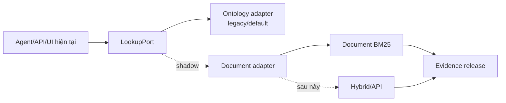

# 06 — Lộ trình, migration và test gates

## 1. Điều kiện xuất phát: baseline hiện chưa hoàn toàn xanh

Kiểm tra ngày 2026-10-01 cho thấy không nên bắt đầu refactor lớn ngay lập tức:

| Kiểm tra | Kết quả hiện tại | Ý nghĩa |
|---|---|---|
| Pytest collect | 158 cases | Đã thu thập được đầy đủ |
| Pytest single-process với temp trong workspace | 156 pass, 2 fail | Hai test CI đọc file `.github` không có trong workspace |
| Retrieval regression | 48/49 top-3, 43/49 top-1 | Mốc chất lượng hiện tại |
| CLI `ontology_search ... search` dạng text | Lỗi `AttributeError` | `ResponsePrinter` gọi API `NodeProfile` cũ |
| Web tests | Chưa chạy được | `webui/node_modules` chưa có; thiếu Vite/Playwright local |
| Evaluation artifacts | Có drift | 5 ID có group cũ trong `quality.json` so với `questions.json` |

Hai pytest fail là:

- `test_image_verifier_checks_the_search_runtime` cần
  `.github/scripts/verify-cpu-runtime.sh`;
- `test_release_workflow_measures_and_verifies_the_image` cần `.github/workflows/ci.yml`.

Đây là lỗi baseline/repository snapshot, không phải lỗi do tài liệu đặc tả. Phiên này
không tự sửa vì người dùng yêu cầu lên plan, nhưng **G0 phải làm baseline trung thực và
xanh trước khi code refactor**.

Năm ID bị drift nhóm evaluation:

```text
question-006297
question-006275
question-006290
gap-001
gap-007
```

Không được dùng `quality.json` hiện tại như ground truth tuyệt đối cho merge gate cho
đến khi drift được giải quyết.

## 2. Chiến lược migration: strangler + compatibility adapter



Nguyên tắc:

- không branch lớn rồi thay tất cả một lần;
- mỗi bước có config rollback;
- shadow mode chạy hai backend trên cùng keyword, nhưng chỉ legacy trả cho người dùng;
- shadow mode không thêm lượt LLM;
- default chỉ đổi khi tất cả gate liên quan đã đạt;
- ontology được giữ ít nhất một chu kỳ benchmark sau cutover.

## 3. `LookupPort` đề xuất

Agent hiện đã gần đúng vì chỉ cần một async callable. Cần bỏ các chỗ runtime đọc ngược
`lookup.engine.ontology`.

```python
class LookupPort(Protocol):
    async def __call__(self, keywords: Sequence[str] | str) -> str: ...
    async def aclose(self) -> None: ...
    def vocabulary(self) -> KnowledgeVocabulary: ...
```

Adapters:

- `OntologyLookupAdapter`: bọc hành vi hiện tại;
- `DocumentLookupAdapter`: tìm `EvidenceUnit`, render JSON V1;
- `ShadowLookupAdapter`: gọi hai adapter, trả legacy, ghi diff có giới hạn.

Factory chọn `ontology|document|shadow`. Admin legacy không được mutate thuộc tính
`.engine` trực tiếp; nó yêu cầu một reload interface rõ ràng.

## 4. Phân loại test khi migration

### 4.1 Retained — giữ nguyên ở lớp dùng chung

- LLM streaming/tool reconstruction/retry;
- AgentLoop, tool event và resource close;
- HTTP/SSE/auth/history/body limit/logging/queue/concurrency/health/CORS;
- input bounds, deduplicate, found/not_found/unmatched;
- source/citation đi cùng evidence;
- refusal và không trả lời từ memory;
- CLI/API/Web UI contract không phụ thuộc ontology.

Các runtime tests chạy một lần ở lớp chung; chỉ backend contract suite được
parameterize cho ontology/document. Không cần nhân đôi mọi HTTP/UI test cho từng backend.

### 4.2 Migrated equivalent — invariant giữ, implementation test thay

| Test ontology | Test document tương đương |
|---|---|
| SHACL conformance | manifest/evidence schema validation |
| citation bag nối fact–source | evidence locator/source resolves |
| TriG source fidelity | Markdown/table fixture fidelity theo cell |
| unique citation coordinate | stable evidence ID + locator uniqueness |
| admin edit không phá graph | release build atomic + invalid data không publish |
| ontology fingerprint/index | source/content hash + release/index manifest |

### 4.3 Intentionally superseded — không bảo tồn nhược điểm cũ

- literal value không được index;
- exact RDF row kinds/object-property shape;
- một âm tiết chung yếu vẫn được coi là match tốt;
- source document không bao giờ là answer;
- sáu câu hỏi nguyên văn điều khoản phải bị loại khỏi retrieval evaluation;
- exact Docker path chỉ dành cho ontology.

Mọi test bị đổi/retire phải có record ba cột:

```text
test cũ | invariant thật sự | test thay thế + lý do
```

Không xóa test chỉ vì backend mới không qua.

## 5. Các gate bắt buộc

### G0 — Baseline trung thực theo hai mốc

Trước **standalone experiment** chỉ cần:

- đóng băng 57 retrieval scenarios, 49 ca legacy-scored và 48 success IDs;
- inventory nguồn/target và ghi corpus release hiện tại;
- giải quyết hoặc report rõ drift của 5 scenario IDs;
- đo build time, peak RAM, artifact size và query p95 của baseline CPU-only;
- không sửa retrieval baseline bằng `--ghi-moc`.

Trước **runtime integration** phải thêm:

- giải quyết hai orphan CI tests hoặc khôi phục file `.github` đúng nguồn;
- sửa và thêm regression test cho CLI text lẫn JSON output;
- cài dependency web, chạy 8 proxy + 19 Playwright cases;
- khóa phiên bản Python/Node/browser cần thiết;
- ghi một lệnh chuẩn chạy full local suite;
- bảo đảm working tree sạch sau test.

**Exit:** phép đo knowledge chạy lặp lại được trước experiment; full suite thực sự xanh
trước khi đụng runtime/UI. Lỗi được cho phép phải có issue/owner/lý do, không chỉ ghi
“known failure”.

### G1 — Standalone vertical slice: Document BM25 + policy tối thiểu

- có manifest, `DocumentVersion`, `EvidenceUnit`, stable ID, hash và validator;
- parser/OCR không là dependency; dùng input đã duyệt;
- build lặp lại cho artifact/hash giống nhau;
- chọn một chủ đề, hai versions, hai cohort/program và một unresolved conflict;
- dựng Document BM25 cùng resolver time/scope/supersedes deterministic;
- đóng băng khoảng 30–50 câu cho vertical slice;
- so ontology-BM25, naïve Document BM25 và policy-aware Document BM25;
- thực hiện bài tập thêm/sửa/thay thế/rollback một quy định và đo phút thao tác;
- đo CPU/RAM/build time/artifact size/query p95 trên máy dev.

**Exit:** có go/no-go report chứng minh hướng mới có lợi về applicability hoặc công cập
nhật mà không phá citation/refusal. Chưa tích hợp AgentLoop/UI và chưa cần `LookupPort`.

### G2 — Corpus coverage migration

- ingest mọi nguồn đã duyệt cần cho scope hiện tại, không chỉ 8 Markdown cùng tên PDF;
- one-time export facts chỉ còn trong ontology thành `KnowledgeRecord` trung lập có
  provenance;
- mọi target trong 57 retrieval và 85 E2E scenarios map tới ít nhất một evidence/record;
- report target thiếu nguồn hoặc chưa thể migrate, không silently drop;
- table/source/locator fidelity tests xanh;
- trước khi metadata version đầy đủ, validator chỉ cho tối đa một approved active
  revision trên mỗi document/scope, từ chối overlap mơ hồ;
- resource metrics nằm trong budget được chốt từ G0/G1, không đặt ngưỡng tùy ý.

**Exit:** knowledge release đủ coverage để phép so parity có ý nghĩa và vẫn build/test
offline, CPU-only, không GPU/API/local model.

### G3 — Legacy safety, port và compatibility adapter

- thêm `LookupPort` và ontology adapter;
- agent/runtime không đọc `.engine.ontology`;
- thêm document adapter và cùng contract suite cho hai backend;
- giữ schema/semantics, tool name và events của lookup V1; prose guidance có chữ
  “ontology” được thay theo backend, không khóa exact wording;
- tạo test replacement ledger và CI check trước khi retire test implementation-specific;
- full legacy suite xanh.

**Exit:** document backend có thể chạy shadow mà kiến trúc ngoài lookup chưa đổi hành vi.

### G4 — Canonical scenario registry và retrieval parity

Tạo một registry nguồn cho scenario metadata/expectations:

```json
{
  "id": "question-...",
  "query": "...",
  "legacy_keywords": ["..."],
  "expected_outcome": "answer|clarify|refuse",
  "expected_targets": ["..."],
  "expected_evidence": ["..."],
  "corpus_release_id": "...",
  "legacy_status": "scored|formerly_excluded",
  "change_reason": null,
  "tags": ["colloquial", "policy"]
}
```

Scenario views được sinh từ registry, không sửa tay độc lập. `results.json` và
`quality.json` là immutable run artifacts join theo ID + run metadata, không phải view
được sinh trước từ registry.

- chạy cả frozen keywords và câu hỏi nguyên bản;
- 57 scenarios đều có report; 8 formerly-excluded có expected evidence/outcome mới;
- không có **unreviewed loss** trong 48 legacy successes;
- nếu old node không còn là gold hợp lý, thay đổi chỉ được chấp nhận khi reviewed
  evidence chứng minh câu vẫn được trả lời đúng và `change_reason` được ghi;
- dùng non-inferiority trên Recall@k/evidence-set recall, không overfit tuyệt đối vào
  exact ontology rank; mọi regression nghiêm trọng phải được phân tích.

**Exit:** parity kỹ thuật và chất lượng retrieval được giải thích, không đạt bằng cách
viết lại baseline âm thầm.

### G5 — Offline integration và live A/B trước cutover

Offline merge gate:

- 85 scenarios chạy offline bằng scripted/fake generator;
- frozen planner fixture kiểm `question → tool call/keywords/no-call`;
- deterministic composer kiểm routing, EvidenceBundle, citation renderer, refusal và SSE;
- suite này chỉ chứng minh orchestration, **không** được gọi là answer-quality proof;
- fault injection cho lookup failure và LLM 429/503/timeout có bounded retry và response
  đọc được;
- kiểm đủ bốn mode `FULL`, `LEXICAL_ONLY`, `EVIDENCE_ONLY`, `UNAVAILABLE`; generation
  lỗi phải render evidence/citation qua SSE hiện có, không chỉ ghi log rồi kết thúc;
- metric tách logical operations, physical attempts, fallback reason và circuit state;
- không cần API key để merge.

Pre-cutover release gate:

- chạy live A/B 85 câu trong cùng đợt, cùng model, prompt và budget cho legacy/document;
- floor: 0/85 runtime errors; không có unreviewed loss trong 48 retrieval successes;
  8/8 gap hiện hành abstain theo chính corpus release đó;
- answer grounding/citation được người review hoặc judge độc lập với identity/model được
  ghi rõ; không dùng một run ngẫu nhiên làm bằng chứng duy nhất;
- `shadow` log found/not_found, target coverage, rank, citation, latency, payload bytes
  và evidence count, không log raw sensitive content;
- update path phải rõ: hoặc có document build/validate/publish workflow đã test, hoặc
  admin legacy bị disable trong document mode với thông báo rõ. Không được “save thành
  công” vào ontology trong khi chat đang đọc document release;
- rollback smoke chạy cả `ontology` và `document` từ cùng deploy artifact; artifact phải
  còn chứa tài nguyên cần cho cả hai config.

**Exit:** mọi case hiện tại chạy lặp lại offline, và chất lượng model thật đã được so
trước khi đổi default.

### G6 — Shadow run, cutover và mở rộng policy-aware

- document backend qua G0–G5;
- default đổi sang `document` trong commit riêng;
- ontology vẫn là fallback ít nhất một release/benchmark cycle;
- mở rộng time/scope/version từ vertical slice theo từng chủ đề có số đo;
- chỉ thêm FAQ cards/rules cho case có giá trị, không dựng platform tổng quát một lần;
- đo thời gian thao tác cập nhật so với ontology.

**Exit:** document là default, rollback thật sự được và mỗi phần policy mở rộng đều có
benchmark riêng.

### G7 — Hybrid experiment

- embedding provider interface + fake;
- vector cache theo content hash;
- exact local search + RRF;
- shadow/fallback tests;
- chỉ bật khi đạt gate chất lượng/latency/cost trong đặc tả hướng B.

**Exit:** hoặc có bằng chứng để bật hybrid, hoặc có kết luận đo được rằng BM25 đủ tốt.

Managed File Search là experiment độc lập sau G3, không nằm trên critical path.

## 6. Thứ tự task/commit nên push

Mỗi task dưới đây là một lát cắt nhỏ, có test và rollback được. Không gom nhiều task
thành một mega-commit.

| Thứ tự | Task | Commit gợi ý | Test tối thiểu trước push |
|---:|---|---|---|
| 0 | Làm baseline trung thực và ghi lệnh chuẩn | `test: restore truthful project baseline` | retrieval; rồi Python + web + CLI trước integration |
| 1 | Thêm schema/fixture evidence cho vertical slice | `feat: add validated evidence contract` | unit + fidelity |
| 2 | Thêm chunker + Document BM25 standalone | `experiment: benchmark document bm25` | chunk/search benchmark |
| 3 | Thêm resolver policy cho vertical slice | `experiment: evaluate policy applicability` | time/scope/conflict cases |
| 4 | Ghi go/no-go và update-cost benchmark | `docs: record knowledge architecture decision` | artifact consistency |
| 5 | Migrate đủ corpus coverage | `data: build document knowledge release` | target coverage + resources |
| 6 | Tách `LookupPort` + replacement ledger | `refactor: isolate knowledge lookup port` | full legacy suite + ledger CI |
| 7 | Thêm compatibility + shadow adapter | `feat: compare document lookup in shadow mode` | runtime + diff tests |
| 8 | Hợp nhất 57/85 scenario metadata | `test: unify qa regression scenarios` | retrieval + offline integration |
| 9 | Hoàn thiện update/admin behavior + live A/B | `test: qualify document backend cutover` | admin mode + 85 live cases |
| 10 | Cutover config/default | `feat: select document knowledge backend` | all gates + two-config rollback |
| 11 | Mở rộng policy theo từng chủ đề | `feat: resolve policy applicability` | scoped version cases |
| 12 | Hybrid shadow experiment | `experiment: evaluate hybrid retrieval` | fake/fallback + benchmark |

Quy tắc push đã thống nhất với người dùng:

- mọi chỉnh sửa file phải được commit và push;
- chỉ stage file thuộc task;
- không commit secret, cache, browser artifact hoặc kết quả live chứa dữ liệu nhạy cảm;
- commit phải tự mô tả được, không dùng message chung chung;
- nếu test chưa xanh, không gọi task là hoàn thành; ghi rõ failure có sẵn nếu task chỉ
  là audit/docs;
- không force-push nếu chưa được yêu cầu.

## 7. Lệnh kiểm tra dự kiến trên Windows

Sau khi G0 hoàn tất:

```powershell
uv sync --extra inference --group dev
uv run pytest -q
uv run python resources/end-to-end/check_retrieval.py

Set-Location webui
npm ci
npx playwright install chromium
npm test
```

Live quality evaluation là lệnh riêng vì cần API key và phát sinh quota/chi phí:

```powershell
uv run python resources/end-to-end/run.py
```

API key chỉ đặt trong environment ở phiên terminal hoặc secret manager; không đặt vào
command history được chia sẻ, Markdown, `.env` đã track hoặc test fixture.

## 8. Tối ưu số lượt LLM nhưng không làm cùng refactor

Mốc tương thích giữ AgentLoop hiện tại: thông thường một lượt model chọn tool/từ khóa
và một lượt diễn đạt sau retrieval. Điều này cô lập biến số “backend tri thức”.

Sau G6 mới làm một experiment riêng:

```text
question
→ deterministic retrieval trực tiếp
→ một lượt LLM diễn đạt
```

Nếu vẫn giữ/đạt retrieval và answer metrics, hướng này giảm một generative call. Nếu
không, giữ vòng tool-call. Không được tuyên bố kiến trúc mới rẻ hơn chỉ vì thay đồng
thời backend, prompt và số lượt model.

## 9. Definition of Done cho toàn đợt refactor

- baseline trung thực và tái lập được trên laptop;
- test bắt buộc chạy offline, không cần GPU/local LLM/API key;
- ontology và document backend có contract chung trong migration;
- 48 legacy retrieval successes không mất;
- 85 scenarios có registry canonical và offline replay;
- citation truy được đến evidence/source/locator;
- update một tài liệu không cần viết lại full ontology;
- parser PDF không nằm trên runtime critical path;
- provider failure có fallback/response hữu ích;
- default backend có rollback rõ;
- benchmark cho biết vì sao có hoặc không thêm hybrid;
- policy-aware cases chứng minh khác biệt so với chatbot tài liệu thông thường.

## 10. Quyết định cuối cùng

```text
Làm ngay:       G0 → standalone Document BM25 → policy vertical slice → go/no-go
Nếu go:         full corpus → LookupPort/adapter → parity + live A/B → cutover
Làm tiếp:       policy metadata/resolver theo từng use case
Chỉ khi có số đo: embedding API + RRF
Chỉ để đối chứng: managed File Search
Chưa làm:       production infrastructure, universal PDF/OCR, full SIS integration
```

Đây là đường ngắn nhất để đạt điều người dùng yêu cầu: hệ thống chạy/test được trước,
thay ontology an toàn sau, và vẫn mở một hướng phát triển có giá trị hơn “chat với PDF”.
