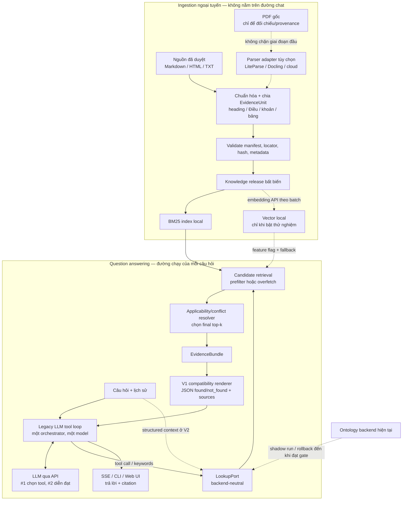

# Kế hoạch refactor kho tri thức của chatbot học vụ

> Trạng thái: đặc tả để review, chưa phải quyết định triển khai và không phải kế hoạch production.
> Ngày khảo sát workspace và nguồn bên ngoài: 2026-10-01.

## Kết luận ngắn

Giải pháp phù hợp nhất trong khuôn khổ hiện tại không phải là thay ontology bằng một
dịch vụ RAG lớn ngay lập tức. Nên đi theo kiến trúc **document-centric có cấu trúc chọn
lọc**, theo thứ tự:

1. Làm baseline hiện tại trung thực và tái lập được trước khi refactor.
2. Dùng Markdown đã duyệt để làm một **standalone vertical slice**: Document BM25 và
   policy metadata tối thiểu cho một chủ đề, chưa đụng UI/runtime.
3. So với ontology-BM25 và naïve Document BM25; chỉ đi tiếp nếu lát cắt chứng minh lợi
   ích về applicability hoặc công cập nhật mà không phá citation/refusal.
4. Migrate đủ corpus, rồi đặt document backend sau adapter giữ nguyên JSON mà agent
   hiện tại đọc; chạy ontology/document song song cho đến khi 57 retrieval scenarios
   và 85 tình huống end-to-end đều được giải thích, không có regression âm thầm.
5. Chỉ thêm embedding qua API ở chế độ thử nghiệm nếu benchmark mới chứng minh BM25
   chưa đủ.
6. Chỉ cấu trúc hóa phần mà tìm đoạn văn không thể giải quyết an toàn: hiệu lực, phạm
   vi áp dụng, quan hệ thay thế văn bản và một số bảng quyết định.

Audit hiện trạng cũng tìm thấy baseline chưa hoàn toàn xanh: 158 Python cases cho kết
quả 156 pass/2 fail vì hai file `.github` bị thiếu; CLI search dạng text có một lỗi API
cũ và web dependencies chưa được cài. Vì vậy task code đầu tiên phải là G0 “baseline
trung thực”, không phải viết retriever mới. Chi tiết nằm trong
[roadmap](06-roadmap-and-test-gates.md#1-điều-kiện-xuất-phát-baseline-hiện-chưa-hoàn-toàn-xanh).

Nói ngắn gọn:

```text
Kiến trúc đích = tài liệu + BM25 + metadata chính sách chọn lọc
                 + dense retrieval tùy kết quả đo
```

Đây không phải multi-agent. Parser, index, bộ lọc hiệu lực và rule engine đều là các
thành phần xác định. Ở mốc parity, một LLM qua API vẫn chọn tool/từ khóa rồi diễn đạt
như runtime hiện tại; “LLM chỉ diễn đạt” là mục tiêu post-parity nếu direct retrieval
bằng câu hỏi gốc vượt benchmark.

## Phạm vi và nguyên tắc quyết định

Ưu tiên hiện tại là:

- chạy được trên máy phát triển hiện có, không cần GPU và không chạy model ngôn ngữ local;
- test tự động không cần API key hay Internet;
- mọi hành vi người dùng và invariant dữ liệu đang có đều được giữ hoặc có replacement
  được review; không khóa vĩnh viễn chi tiết RDF/SHACL chỉ thuộc implementation cũ;
- cập nhật tri thức từ tài liệu dễ hơn nhập lại nội dung thành RDF;
- giữ nguồn và vị trí trích dẫn, không biến thành chatbot “upload PDF rồi chat”;
- parsing tài liệu và hỏi đáp là hai bài toán tách biệt;
- chưa thêm PostgreSQL, vector database, Kubernetes hoặc hạ tầng production nếu dữ
  liệu và phép đo hiện tại chưa cần.

Ngoài phạm vi của kế hoạch này:

- giải OCR/chữ viết tay/layout cho mọi loại PDF;
- tích hợp dữ liệu sinh viên thật từ SIS;
- loại bỏ ontology ngay trong lần refactor đầu;
- cam kết SLA production;
- dùng LLM để thay rule engine hoặc để tự phân xử văn bản mâu thuẫn.

## Sơ đồ kiến trúc tổng quan đề xuất



Điểm quan trọng của sơ đồ:

- QA chỉ nhận `EvidenceUnit`; nó không cần biết tài liệu được gõ lại, OCR local hay
  parse bằng cloud.
- Metadata applicability được dùng để prefilter khi backend hỗ trợ; nếu không, retriever
  phải lấy dư candidate rồi lọc/refill. Chỉ cắt `top_k` sau resolver để không loại mất
  evidence đúng vì ba kết quả đầu thuộc sai thời điểm/phạm vi.
- Giai đoạn tương thích vẫn giữ vòng agent và số lượt gọi model hiện tại. Tối ưu còn
  một lượt sinh chỉ thực hiện sau khi đã đạt parity, để không trộn hai thay đổi lớn.
- Nếu embedding API lỗi, BM25 vẫn hoạt động. Nếu API sinh câu trả lời lỗi, backend
  deterministically render `EvidenceBundle` thành các event `text_delta/completed` hiện
  có để trả evidence + citation; chưa cần đổi UI bằng event mới. Contract suy giảm này
  phải có test trước khi tính điểm resilience cao.

## Các hướng được đặc tả

| Hướng | Vai trò hợp lý | Kết luận |
|---|---|---|
| [A. Document BM25](02-document-bm25.md) | Backend đầu tiên để thay cách lưu tri thức | **Làm trước** |
| [B. Hybrid BM25 + embedding API](03-hybrid-retrieval.md) | Nâng recall cho paraphrase/đồng nghĩa | Chỉ bật khi benchmark chứng minh có lợi |
| [C. Managed File Search](04-managed-file-search.md) | Baseline/PoC để so sánh | Không chọn làm lõi hiện tại |
| [D. Policy-aware chọn lọc](05-policy-aware-layer.md) | Xử lý hiệu lực, phạm vi, xung đột, rule | **Kiến trúc đích**, xây dần trên A |

Các lựa chọn không hoàn toàn cùng một tầng. A/B/C là cách retrieval; D là cách tổ chức
tri thức và xác định evidence nào thực sự áp dụng. Khuyến nghị cuối cùng là **D + A**,
sau đó có thể thêm B. C chỉ là đối chứng managed.

## Ma trận quyết định minh bạch

Điểm từ 1 đến 5; 5 là phù hợp nhất. Tổng điểm dùng công thức:

```text
Tổng = Σ(điểm tiêu chí / 5 × trọng số)
```

Đây là heuristic để chọn hướng cho prototype hiện tại, không phải kết quả benchmark
chất lượng.

| Phương án | Laptop 15% | Test parity 20% | Cập nhật/citation/control 20% | Trần retrieval 15% | Runtime resilience 5% | Vendor portability 5% | Tốc độ làm 10% | Khác biệt đề tài 10% | Tổng |
|---|---:|---:|---:|---:|---:|---:|---:|---:|---:|
| Ontology + BM25 hiện tại, làm mốc | 5 | 5 | 1 | 3 | 4 | 4 | 5 | 4 | **74** |
| A. Document BM25 tối giản | 5 | 5 | 4 | 3 | 5 | 5 | 5 | 2 | **84** |
| B. BM25 + dense embedding API | 4 | 4 | 4 | 5 | 4 | 4 | 3 | 3 | **79** |
| C1. Gemini File Search | 5 | 2 | 3 | 4 | 1 | 1 | 5 | 1 | **61** |
| C2. Managed Agent Search | 5 | 2 | 4 | 5 | 2 | 2 | 3 | 1 | **66** |
| D. Policy-aware chọn lọc + Document BM25 | 5 | 5 | 4 | 4 | 5 | 5 | 3 | 5 | **89** |

Rubric: 1 là xung đột mạnh với constraint hiện tại, 3 là dùng được nhưng cần trade-off,
5 là đáp ứng trực tiếp. `Laptop` chấm nhu cầu GPU/RAM/service local; `test parity` chấm
khả năng test offline/deterministic; `resilience` chấm fallback khi provider lỗi;
`portability` chấm mức đổi provider không phải rebuild cả pipeline. Đây là điểm **kiến
trúc mục tiêu end-to-end**, không phải trạng thái code hôm nay; điểm resilience 5 của
A/D chỉ có hiệu lực sau khi `EVIDENCE_ONLY` được triển khai và test.

D cao nhất ở kiến trúc đích nhưng tốn công hơn A. Vì vậy dùng A để dựng baseline, thêm
một lát cắt D nhỏ trước khi quyết định migration toàn corpus; không xây toàn bộ D trong
một nhánh lớn.

## Bản đồ tài liệu để review

1. [Hiện trạng, ràng buộc và hợp đồng phải giữ](01-baseline-and-contracts.md)
2. [Đặc tả hướng A — Document BM25](02-document-bm25.md)
3. [Đặc tả hướng B — Hybrid retrieval](03-hybrid-retrieval.md)
4. [Đặc tả hướng C — Managed File Search](04-managed-file-search.md)
5. [Đặc tả hướng D — Policy-aware chọn lọc](05-policy-aware-layer.md)
6. [Lộ trình, chiến lược migration và test gates](06-roadmap-and-test-gates.md)

## Căn cứ nghiên cứu chính

- [Gemini File Search](https://ai.google.dev/gemini-api/docs/file-search): dịch vụ tự
  import, chunk, index và retrieval; có giới hạn, chi phí indexing/context và phụ thuộc
  cùng một provider cho retrieval lẫn generation.
- [Gemini Embeddings](https://ai.google.dev/gemini-api/docs/embeddings): embedding model,
  batch embeddings và yêu cầu re-embed khi đổi sang không gian vector không tương thích.
- [Gemini troubleshooting](https://ai.google.dev/gemini-api/docs/troubleshooting) và
  [API errors](https://ai.google.dev/gemini-api/docs/api-errors): lỗi rate-limit/503/
  timeout có thể retry hữu hạn với backoff+jitter, còn `quota_exceeded`, auth và request
  sai không được retry ngắn hạn chỉ dựa vào HTTP status.
- [pgvector — Hybrid Search](https://github.com/pgvector/pgvector/blob/master/README.md#hybrid-search):
  full-text và vector có thể kết hợp bằng Reciprocal Rank Fusion; tài liệu này chỉ là
  căn cứ cho thuật toán, không phải lý do cài PostgreSQL ngay.
- [LiteParse](https://github.com/run-llama/liteparse): parser local nhẹ, có Tesseract;
  phù hợp làm một adapter nhưng không bảo đảm xử lý mọi layout/OCR.
- [Docling document model](https://docling-project.github.io/docling/concepts/docling_document/):
  biểu diễn có cấu trúc cho text, table, picture và reading order; mạnh hơn nhưng nặng
  hơn, nên chỉ là fallback ingestion ngoại tuyến.
- [ALCE, EMNLP 2023](https://aclanthology.org/2023.emnlp-main.398/): đánh giá câu trả lời
  có citation cần tách correctness, citation correctness và citation completeness.
- [PostgreSQL range types](https://www.postgresql.org/docs/current/rangetypes.html) và
  [OMG DMN](https://www.omg.org/dmn/): tham khảo cho hiệu lực theo khoảng thời gian và
  decision table; không phải dependency bắt buộc ở prototype.

Các đường link và nhận định trên phải được kiểm tra lại tại thời điểm triển khai vì
model, giá, quota và giới hạn dịch vụ có thể thay đổi.
